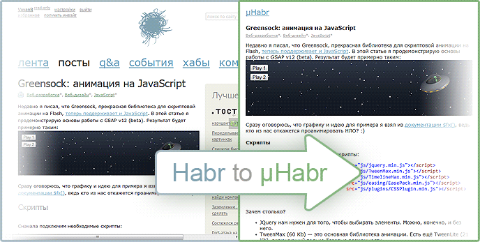

# Habr To mHabr Bookmarklet

Букмарклет, переключающий статью в мобильный вид.
Поддерживает Habrahabr и Geektimes:
```
http://habrahabr.ru/post/249975/ → http://m.habrahabr.ru/post/249975/
http://habrahabr.ru/company/foo/blog/123456/ → http://m.habrahabr.ru/company/foo/blog/123456/
http://geektimes.ru/post/245482/ → http://m.geektimes.ru/post/245482/
http://geektimes.ru/company/foo/blog/123456/ → http://m.geektimes.ru/company/foo/blog/123456/
```



## Установка
Копируем [код букмарклета](./dist/bookmarklet.js) на панель закладок

## Сборка
Запускаем
```sh
gulp
```

## License
MIT © [Vladimir Rodkin](https://github.com/VovanR)
